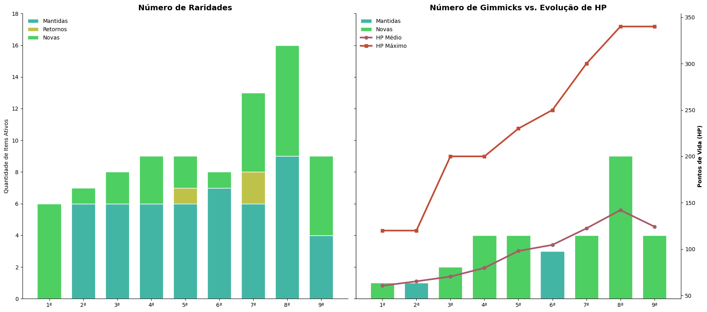

# Relatório

> [!CAUTION]
>
> - Você <ins>**não pode utilizar ferramentas de IA para escrever este relatório**</ins>.

## Identificação

- **Nome**: João Pedro Simon Figueiró
- **Cartão UFRGS:** 5899908

## Dados utilizados

> [!IMPORTANT]
>
> - Os dados utilizados devem ser informados como **links** para as fontes originais.
> - Se houver mais de um conjunto de dados, liste todos separadamente.
> - Para cada conjunto de dados, inclua também uma **descrição curta** explicando os dados.

1. **Dataset 1**: [link](https://www.kaggle.com/datasets/adampq/pokemon-tcg-all-cards-1999-2023/data)
    * **Descrição curta**: Dataset contendo informação abrangente sobre cartas e sets do Pokémon Trading Card Game (TCG) de 1999 até 2023.

## Código-fonte da visualização

> [!IMPORTANT]
>
> - Indique abaixo onde está, dentro deste repositório, o código-fonte usado para gerar a visualização.

- **Arquivo principal**: lab3compgvis.ipynb

## Imagem da visualização gerada

> [!IMPORTANT]
>
> - Insira aqui uma imagem da visualização criada por você. Troque `imagem-da-visualizacao.png` pelo caminho correto do arquivo no repositório. 

## Descrição da visualização

### Legenda (*caption*)

> [!IMPORTANT]
>
> - Escreva um texto curto explicando como interpretar a visualização. Descreva os elementos visuais, eixos, cores, símbolos ou interações relevantes.
> - Este texto seria a legenda (*caption*) que acompanharia a figura em uma publicação, por exemplo.

A figura compara a evolução do número de raridades e mecânicas especiais ("gimmicks") nas cartas de Pokémon TCG entre 1999 e 2023, através das nove gerações de jogos. No painel esquerdo, cada barra representa o total de categorias de raridade ativas em uma geração, decompostas em três segmentos coloridos: raridades que permaneceram desde a geração passada (azul), raridades que haviam desaparecido e retornaram (amarelo) e raridades totalmente novas (verde). O crescimento da barra ao longo do eixo horizontal mostra a tendência de aumento na complexidade no sistema de raridades, com poucos retornos de raridades que haviam sido descartadas e predomínio de adições novas a cada geração.
O painel direito cruza duas métricas para as mesmas gerações: as barras (eixo esquerdo, em quantidade de itens) indicam o número de mecânicas especiais de carta ("gimmicks"), como EX, GX, V e TAG TEAM, que estavam ativas em cada geração, também divididas em mantidas e novas; linhas sobrepostas (eixo direito, em pontos de vida) mostram o HP médio e o HP máximo das cartas de tipo Pokémon lançadas na mesma geração. A leitura conjunta revela que o aumento no número de mecânicas coincide com uma escalada acentuada de HP, sugerindo que a introdução de novas mecânicas está associada a um fenômeno de "power creep (cartas sucessivamente mais poderosas ao longo do tempo).

### Conclusão demonstrada pela visualização

> [!IMPORTANT]
>
> - Escreva uma conclusão curta sobre os dados com base na visualização.
> - Explique qual insight, padrão ou tendência pode ser observado.

Os gráficos revelam uma faceta bastante prevalente na história do desenvolvimento do Pokémon TCG: a complexidade crescente no design das cartas ao longo dos anos. Como um produto persistente por quase 25 anos, as empresas responsáveis por ele criaram diversas variações nas cartas lançadas, seja adicionando novas raridades para colecionar, seja introduzindo mecânicas especiais para apimentar a jogabilidade, atrair novos jogadores e acompanhar as mudanças na linha principal de jogos digitais. A maioria dessas gimmicks durou pouco, sendo descartada já na geração seguinte, mas o acúmulo delas impulsionou o nível de poder geral das cartas, refletido no HP médio e máximo por geração — cada mecânica nova, para chamar atenção, precisava destronar a anterior com valores ainda mais altos. Esse padrão atingiu seu ápice entre a 7ª e a 8ª geração, com uma explosão de novas raridades e mecânicas. Por causa disso, a 9ª geração trabalhou para conter essa escalada, reduzindo drasticamente a quantidade de raridades e gimmicks e, propositalmente, baixando o HP médio das cartas.
Alguns detalhes a se ressaltar:
> - O número de raridades mantidas permaneceu estável ao longo das gerações, sugerindo que apesar de novas raridades serem adicionadas ao longo dos anos, as iniciais permaneceram servindo como base;
> - As mecânicas especiais quase sempre são descartadas de uma geração para outra, com exceção da 2ª e 6ª gerações, reforçando seu caráter como "gimmicks";
> - A 6ª geração representa uma anomalia, sendo a primeira a reduzir o número de raridades e mecânicas especiais. Ainda assim, o HP médio e máximo dos Pokémon continuou subindo;
> - O retorno de raridades previamente removidas é um evento raro, embora tenha acontecido três vezes, diferente do retorno de "gimmicks", que nunca aconteceu.
